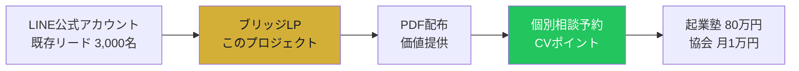
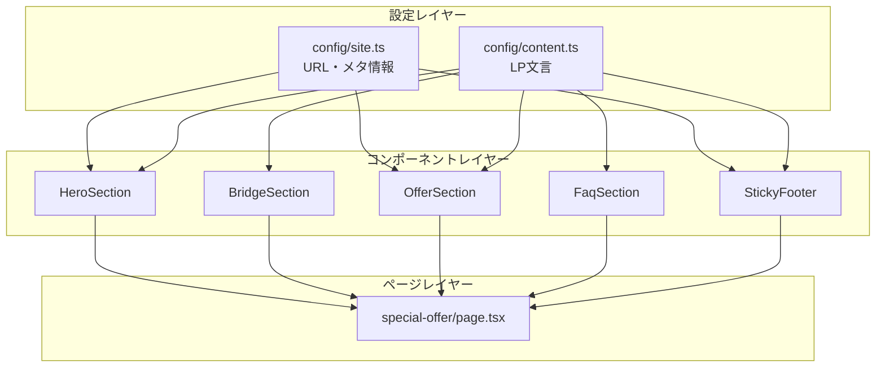

# PROJECT BLUEPRINT
## 訪問看護スペシャルオファーLP - 要件定義とビジネスロジック

> このドキュメントは、プロジェクトの「なぜ」を説明します。  
> 技術的な「どのように」は `TECH_SPEC.md` を参照してください。

---

## 1. Concept & Strategy

### 1.1 プロジェクトの位置づけ



このLPは「休眠リードの再活性化」を目的とした**ブリッジページ**です。

1. **入口**: LINE配信でLPに誘導
2. **フック**: 有料級PDFの無料配布で信頼獲得
3. **ブリッジ**: 「PDFだけでは不十分」というGap Logicで個別相談へ誘導
4. **出口**: 無料相談予約 → バックエンド商品へ

---

### 1.2 なぜこのデザインなのか？

#### Navy × Gold × White のカラー戦略

| カラー | 心理効果 | 使用箇所 |
|--------|----------|----------|
| **Navy (#0f172a)** | 信頼性・専門性・権威 | メインテキスト、セカンダリCTA |
| **Gold (#d4af37)** | 成功・価値・高級感 | プライマリCTA、アクセント、ハイライト |
| **White (#ffffff)** | 清潔感・読みやすさ | 背景 |

> **設計意図**: 「年商5億」という実績を視覚的に裏付けるため、安っぽい色使いを避け、金融機関やコンサルティングファームを想起させる配色を採用。

#### モバイルファースト設計

- **ターゲットデバイス**: LINEアプリ内ブラウザ（iOS/Android）
- **想定比率**: モバイル 99% / デスクトップ 1%
- **最適化ポイント**:
  - タップしやすい大きなCTAボタン（h-16, py-5）
  - スティッキーフッターでスクロール位置に関係なくCVポイントを確保
  - iOS Safe Area対応（`env(safe-area-inset-bottom)`）

#### アニメーション戦略

| エフェクト | 目的 | 実装 |
|------------|------|------|
| **Shimmer Effect** | CTAへの視線誘導 | ホバー時に光沢が走る |
| **Pulse Glow** | プライマリCTAの存在感強調 | ゴールドの脈打つ光 |
| **CTA Shake** | 5秒ごとの注意喚起 | プルプル揺れるマイクロインタラクション |
| **Stagger Animation** | 読みやすさ向上 | 要素が順番にフェードイン |

---

### 1.3 なぜこの構成なのか？（ライティング法則）

#### PASTOR フレームワークの適用

```
P - Problem（問題）     → ヒーローで「失敗する前に」と暗示
A - Amplify（増幅）     → ブリッジで「PDFだけでは不十分」と危機感醸成
S - Story/Solution      → 「年商5億の実績」というストーリー
T - Transformation      → 「迷いがゼロになる」という変化の約束
O - Offer（提案）       → 無料個別作戦会議 + 3つの特典
R - Response（行動喚起）→ 複数のCTAポイントで逃さない
```

#### Reason Why（緊急性の正当化）

> 「本来は有料会員（月1万円）限定資料のため、既存会員への配慮として公開停止の可能性あり」

**なぜこの理由なのか？**
- 単なる「期間限定」ではなく、**第三者（既存会員）への配慮**という正当な理由
- 読者は「自分だけ特別扱いされている」と感じる
- 希少性と緊急性を同時に演出

---

## 2. User Personas

### Persona A: 開業準備中の看護師

| 属性 | 詳細 |
|------|------|
| **年齢** | 30〜45歳 |
| **職業** | 病院勤務の看護師（管理職経験あり） |
| **課題** | 開業したいが、何から始めればいいかわからない |
| **恐怖** | 失敗して借金を抱えること |
| **欲求** | 成功者の具体的なロードマップがほしい |
| **行動** | 情報収集段階。まずは無料で学びたい |

**LP上での心理変化**:
1. 「年商5億の地図が無料？」→ PDF取得
2. 「確かに一般論だけでは不安...」→ Gap Logic納得
3. 「自分のエリアで具体的に相談できるなら」→ 予約

### Persona B: 運営に悩む既存経営者

| 属性 | 詳細 |
|------|------|
| **年齢** | 35〜55歳 |
| **職業** | 訪問看護ステーション経営者（1〜2拠点） |
| **課題** | 採用が回らない、売上が頭打ち |
| **恐怖** | これ以上スケールできないまま疲弊すること |
| **欲求** | 5店舗に拡大した人の「仕組み」を知りたい |
| **行動** | 課題が明確。具体的な解決策を求めている |

**LP上での心理変化**:
1. 「5億の人の戦略を見てみたい」→ PDF取得
2. 「うちのエリアだとどうなんだろう」→ Gap Logic納得
3. 「30分で競合分析してくれるなら」→ 予約

---

## 3. Functional Requirements

### 3.1 実装済み機能

| 機能 | 説明 | 実装ファイル |
|------|------|--------------|
| **緊急告知ヘッダー** | 画面上部固定の警告バー | `hero/emergency-header.tsx` |
| **PDFプレビュー** | 資料の価値を視覚化 | `hero/hero-section.tsx` |
| **Gap Logic セクション** | 地図 vs コンパスの比喩 | `bridge/bridge-section.tsx` |
| **希少性表示** | 月間5名限定 | `offer/offer-section.tsx` |
| **特典リスト** | 相談者限定3つの特典 | `offer/offer-section.tsx` |
| **アコーディオンFAQ** | `<details>`タグで実装 | `faq/faq-section.tsx` |
| **スティッキーCTA** | スクロール300px以降で表示 | `cta/sticky-footer.tsx` |
| **シェイクアニメーション** | 5秒ごとにCTAが揺れる | `cta/sticky-footer.tsx` |

### 3.2 データフロー



---

## 4. Prompt Engineering Context

> 今後AIに指示を出す際、このセクションを読ませれば文脈を理解できます。

### プロジェクトサマリー（AI向け）

```
【プロジェクト概要】
- 訪問看護事業の開業・経営支援サービスのLP
- バックエンド: 起業塾(80万円) / 協会(月1万円)
- 配信チャネル: LINE公式（モバイル99%）
- 目的: PDFダウンロード → 個別相談予約へのCV最大化

【技術スタック】
- Next.js 16 (App Router) + TypeScript + Tailwind CSS 4 + Framer Motion
- サーバー/クライアントコンポーネントの分離は未最適化（全てuse client）

【デザインシステム】
- カラー: Navy(#0f172a) / Gold(#d4af37) / White
- フォント: Noto Sans JP
- アニメーション: Shimmer, Pulse Glow, CTA Shake, Stagger

【ファイル構造の重要ポイント】
- コンテンツ文言: src/config/content.ts（ライター編集用）
- URL設定: src/config/site.ts
- UIコンポーネント: src/components/ui/（Button, Badge, Card）
- 機能コンポーネント: src/components/features/（Hero, Bridge, Offer, FAQ, CTA）

【ビジネスロジック】
- Reason Why: 「有料会員限定資料の期間限定公開」で緊急性を正当化
- Gap Logic: 「PDFは一般論、あなたには専用コンパスが必要」
- 希少性: 月間5名限定（現場稼働のため）
- 特典: お仕事説明会サンプル / 営業トークサンプル / 訪問同行指導テンプレート
```

### よくある指示パターン

| やりたいこと | 指示例 |
|--------------|--------|
| 文言変更 | 「content.tsのhero.descriptionを〇〇に変更して」 |
| 色変更 | 「globals.cssの--color-goldを〇〇に変更して」 |
| セクション追加 | 「OfferSectionの下に実績セクションを追加して」 |
| アニメーション調整 | 「animations.tsのstaggerChildrenを0.2に変更して」 |

---

## 5. Future Considerations

### 5.1 パフォーマンス最適化案

- [ ] 静的コンテンツのサーバーコンポーネント化
- [ ] 画像の最適化（next/image導入）
- [ ] フォントのサブセット化

### 5.2 機能拡張案

- [ ] A/Bテスト機能（CTAの色・文言）
- [ ] Google Analytics / GTM連携
- [ ] 予約完了後のサンクスページ
- [ ] LINE連携（LIFF）での自動情報取得

---

*Last Updated: 2025-12-04*


