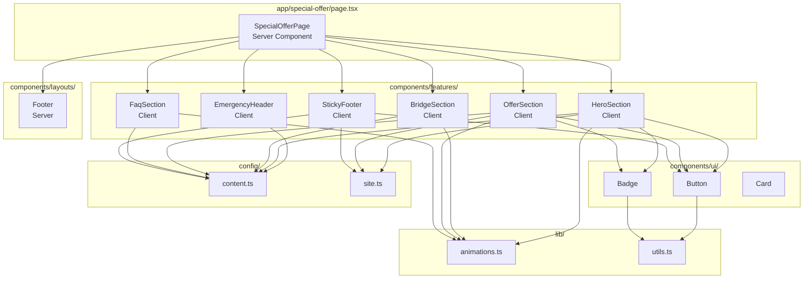
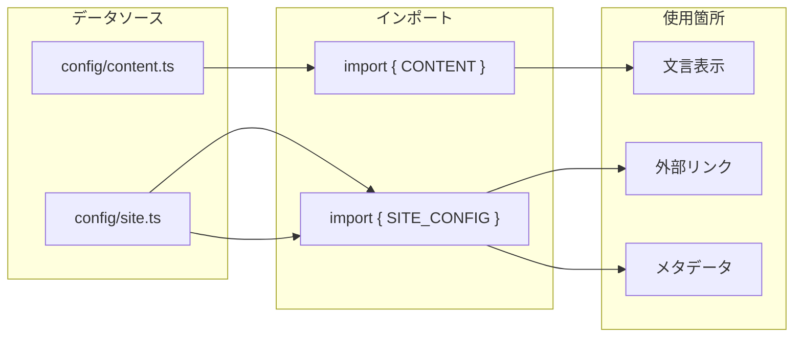

# TECH SPEC
## 訪問看護スペシャルオファーLP - 技術設計図

> このドキュメントは、プロジェクトの「どのように」を説明します。  
> ビジネスロジックの「なぜ」は `PROJECT_BLUEPRINT.md` を参照してください。

---

## 1. Directory Structure

```
rich_gift/
├── src/
│   ├── app/                              # Next.js App Router
│   │   ├── globals.css                   # グローバルスタイル・デザイントークン
│   │   ├── layout.tsx                    # ルートレイアウト（フォント・メタデータ）
│   │   ├── page.tsx                      # / → /special-offer へリダイレクト
│   │   └── special-offer/
│   │       └── page.tsx                  # メインLP（サーバーコンポーネント）
│   │
│   ├── components/
│   │   ├── features/                     # 機能別コンポーネント（ビジネスロジック含む）
│   │   │   ├── hero/
│   │   │   │   ├── emergency-header.tsx  # 緊急告知バー
│   │   │   │   ├── hero-section.tsx      # ヒーローセクション
│   │   │   │   └── index.ts              # バレルエクスポート
│   │   │   ├── bridge/
│   │   │   │   ├── bridge-section.tsx    # ブリッジセクション（Gap Logic）
│   │   │   │   └── index.ts
│   │   │   ├── offer/
│   │   │   │   ├── offer-section.tsx     # オファーセクション
│   │   │   │   └── index.ts
│   │   │   ├── faq/
│   │   │   │   ├── faq-section.tsx       # FAQセクション
│   │   │   │   └── index.ts
│   │   │   └── cta/
│   │   │       ├── sticky-footer.tsx     # スティッキーCTA
│   │   │       └── index.ts
│   │   │
│   │   ├── layouts/                      # レイアウトコンポーネント
│   │   │   ├── footer.tsx                # フッター
│   │   │   └── index.ts
│   │   │
│   │   └── ui/                           # プリミティブUIコンポーネント
│   │       ├── button.tsx                # CVA対応ボタン
│   │       ├── badge.tsx                 # バッジ
│   │       └── card.tsx                  # カード系
│   │
│   ├── config/                           # 設定・コンテンツ
│   │   ├── content.ts                    # LP文言（ライター編集用）
│   │   └── site.ts                       # サイト設定・外部URL
│   │
│   ├── hooks/                            # カスタムフック
│   │   └── use-scroll-visibility.ts      # スクロール位置監視
│   │
│   └── lib/                              # ユーティリティ
│       ├── animations.ts                 # Framer Motionバリアント
│       └── utils.ts                      # cn()関数（Tailwindマージ）
│
├── public/                               # 静的アセット
├── package.json
├── tsconfig.json
├── next.config.ts
├── README.md
├── PROJECT_BLUEPRINT.md
└── TECH_SPEC.md
```

---

## 2. Component Architecture

### 2.1 コンポーネント依存関係図



### 2.2 コンポーネント詳細

| コンポーネント | 種類 | 責務 | Props |
|---------------|------|------|-------|
| `EmergencyHeader` | Client | 緊急告知バー、固定表示 | なし |
| `HeroSection` | Client | PDF配布、価値訴求 | なし |
| `BridgeSection` | Client | Gap Logic、問題提起 | なし |
| `OfferSection` | Client | 無料相談誘導、特典表示 | なし |
| `FaqSection` | Client | アコーディオンFAQ | なし |
| `StickyFooter` | Client | スクロール追従CTA | なし |
| `Footer` | Server | 著作権表示 | なし |
| `Button` | Client | CVA対応ボタン | `variant`, `size`, `fullWidth`, `shake` |
| `Badge` | Server | バッジ | `variant` |
| `Card` | Server | カードコンテナ | `className` |

---

## 3. Design System

### 3.1 Color Tokens

```css
/* Primary - Navy（信頼・権威） */
--color-navy: #0f172a;
--color-navy-light: #1e293b;
--color-navy-dark: #020617;

/* Accent - Gold（成功・価値） */
--color-gold: #d4af37;
--color-gold-light: #e6c75a;
--color-gold-dark: #b8972f;

/* Semantic */
--color-success: #22c55e;
--color-warning: #f59e0b;
--color-error: #ef4444;

/* Neutral */
--color-white: #ffffff;
--color-slate-50: #f8fafc;
--color-slate-100: #f1f5f9;
--color-slate-600: #475569;
--color-slate-900: #0f172a;
```

### 3.2 Typography

| 要素 | フォント | ウェイト | サイズ |
|------|----------|----------|--------|
| **見出し1** | Noto Sans JP | 900 (Black) | text-2xl / text-3xl |
| **見出し2** | Noto Sans JP | 900 (Black) | text-xl / text-2xl |
| **本文** | Noto Sans JP | 400 (Regular) | text-base |
| **キャプション** | Noto Sans JP | 400 (Regular) | text-xs / text-sm |

### 3.3 Spacing & Layout

| トークン | 値 | 使用箇所 |
|----------|-----|----------|
| **max-w-md** | 448px | コンテンツ最大幅 |
| **px-5** | 20px | セクション左右パディング |
| **py-10/12** | 40px/48px | セクション上下パディング |
| **gap-3/4** | 12px/16px | 要素間スペース |
| **rounded-xl/2xl** | 12px/16px | 角丸 |

### 3.4 Breakpoints

| Name | Width | 対応 |
|------|-------|------|
| **default** | 0px〜 | モバイル（基準） |
| **sm** | 640px〜 | 大きめモバイル |
| **md** | 768px〜 | タブレット |
| **lg** | 1024px〜 | デスクトップ |

> **Note**: モバイルファースト設計のため、ほとんどの場合 `sm:` までで完結

---

## 4. Animation System

### 4.1 Framer Motion バリアント

```typescript
// lib/animations.ts

// スタガードコンテナ（子要素を順番に表示）
export const staggerContainer = {
  animate: {
    transition: {
      staggerChildren: 0.1,
      delayChildren: 0.2,
    },
  },
};

// スタガードアイテム
export const staggerItem = {
  initial: { opacity: 0, y: 15 },
  animate: { opacity: 1, y: 0 },
  transition: { duration: 0.4, ease: "easeOut" },
};
```

### 4.2 CSS アニメーション

| クラス | 効果 | トリガー |
|--------|------|----------|
| `.shimmer-effect` | 光沢が走る | ホバー時 |
| `.pulse-glow` | ゴールドの脈打つ光 | 常時（2秒周期） |
| `.cta-shake` | プルプル揺れる | JS制御（5秒ごと） |
| `.animate-pulse` | 透明度パルス | 常時（Tailwind標準） |
| `.animate-bounce` | 上下バウンス | 常時（Tailwind標準） |

---

## 5. Data Flow

### 5.1 コンテンツデータ



### 5.2 content.ts の構造

```typescript
export const CONTENT = {
  emergencyHeader: { prefix, message },
  hero: { badge, subtitle, title, description, cta, reasonWhy },
  bridge: { confirmation, warning },
  offer: { badge, title, subtitle, benefits, scarcity, bonuses, bonusNote, cta },
  faq: { title, items[] },
  footer: { copyright },
} as const;
```

### 5.3 site.ts の構造

```typescript
export const SITE_CONFIG = {
  name: string,
  description: string,
  author: string,
  copyright: string,
  links: {
    pdfDownload: string,
    consultation: string,
    mainSite: string,
  },
  stats: {
    stores: number,
    revenue: string,
    staff: number,
    visitsPerMonth: string,
  },
} as const;
```

---

## 6. State Management

### 6.1 クライアント状態

| 状態 | 管理方法 | 使用箇所 |
|------|----------|----------|
| スクロール位置 | `useScrollVisibility` フック | `StickyFooter` |
| シェイク状態 | `useState` + `setInterval` | `StickyFooter` |

### 6.2 useScrollVisibility フック

```typescript
// hooks/use-scroll-visibility.ts
export function useScrollVisibility(threshold: number = 300) {
  const [isVisible, setIsVisible] = useState(false);

  useEffect(() => {
    const handleScroll = () => {
      setIsVisible(window.scrollY > threshold);
    };
    window.addEventListener("scroll", handleScroll, { passive: true });
    return () => window.removeEventListener("scroll", handleScroll);
  }, [threshold]);

  return isVisible;
}
```

---

## 7. Button Component API

### 7.1 Variants（class-variance-authority）

```typescript
const buttonVariants = cva(baseStyles, {
  variants: {
    variant: {
      primary: "Gold gradient, shimmer effect",
      secondary: "Navy gradient",
      outline: "Gold border",
      ghost: "Transparent",
      urgent: "Red gradient (スティッキーCTA用)",
    },
    size: {
      sm: "h-10 px-4 text-sm",
      md: "h-12 px-6 text-base",
      lg: "h-14 px-8 text-lg",
      xl: "h-16 px-10 text-xl",
    },
    fullWidth: {
      true: "w-full",
      false: "",
    },
  },
});
```

### 7.2 使用例

```tsx
<Button variant="primary" size="xl" fullWidth>
  今すぐPDFを受け取る
</Button>

<Button variant="urgent" size="lg" fullWidth className={shake ? "cta-shake" : ""}>
  無料で作戦会議を予約する 📅
</Button>
```

---

## 8. Performance Considerations

### 8.1 現状

| 項目 | 状態 | 備考 |
|------|------|------|
| **Client Components** | 多い | ほぼ全セクションが `"use client"` |
| **画像最適化** | 未実装 | PDFプレビューはCSS生成 |
| **フォント** | 最適化済み | `next/font` + `display: swap` |
| **バンドルサイズ** | 未計測 | Framer Motion が大きめ |

### 8.2 最適化案

1. **Server/Client分離**
   - 静的テキスト部分をサーバーコンポーネント化
   - インタラクティブ部分のみを `"use client"` でラップ

2. **Dynamic Import**
   - `StickyFooter` を遅延読み込み（スクロール後にしか表示されないため）

3. **画像最適化**
   - PDFプレビューを実画像化する場合は `next/image` を使用

---

## 9. Development Notes

### 9.1 ローカル開発

```bash
npm run dev    # http://localhost:3000（Turbopack）
```

### 9.2 ビルド確認

```bash
npm run build  # 本番ビルド
npm run start  # 本番サーバー起動
```

### 9.3 Lint

```bash
npm run lint   # ESLintチェック
```

### 9.4 型チェック

```bash
npx tsc --noEmit  # TypeScript型チェック
```

---

## 10. Deployment

### 10.1 推奨環境

- **Vercel**（Next.js公式）
- **Node.js** 18.x 以上

### 10.2 環境変数

現時点で環境変数は不要。すべての設定は `config/` 内で管理。

### 10.3 本番前チェックリスト

- [ ] `config/site.ts` の `pdfDownload` URLを本番URLに変更
- [ ] `config/site.ts` の `consultation` URLを本番URLに変更
- [ ] OGP画像の設定（`app/opengraph-image.png`）
- [ ] Google Analytics / GTM の設置

---

*Last Updated: 2025-12-04*

